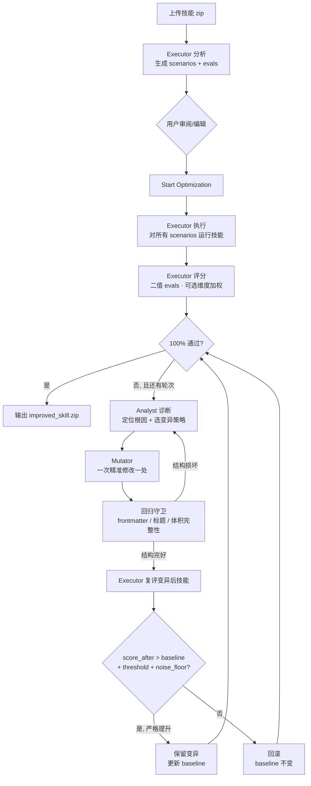
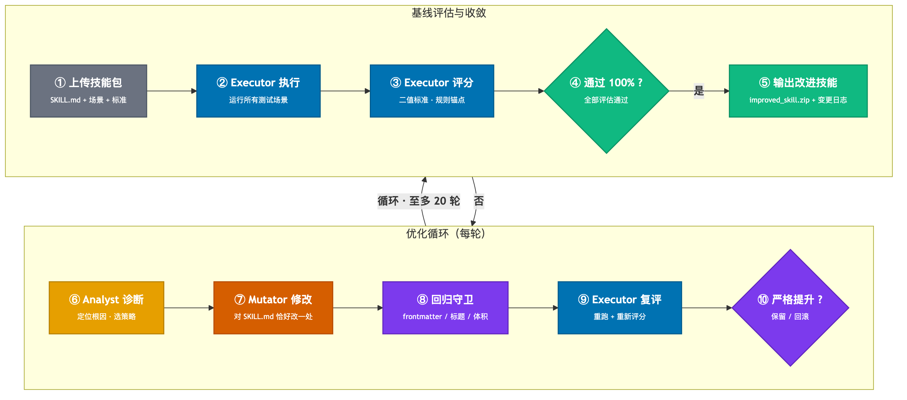
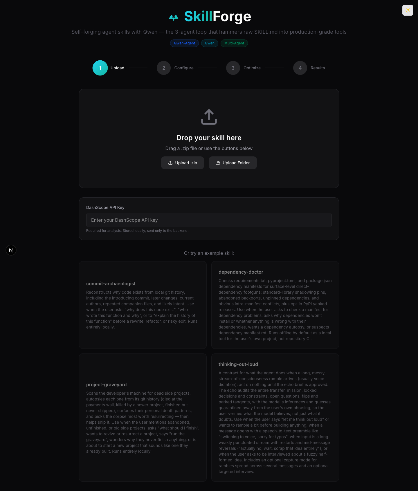
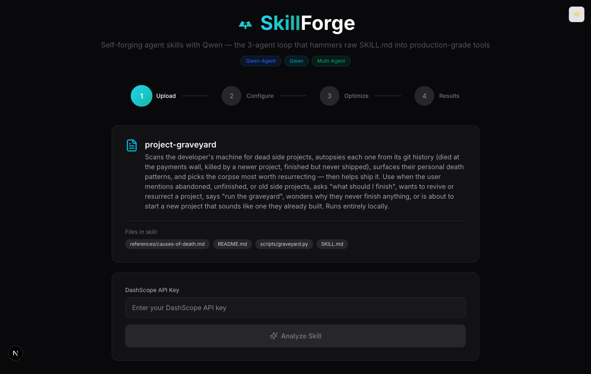

# SkillForge 操作手册

> **SkillForge** —— 基于 LangGraph 状态图编排 + 阿里云百炼 DashScope 直调的「自我改进 Agent 技能」系统
> 把 SKILL.md 放上传站，三个角色（Executor / Analyst / Mutator）循环锤打，只保留严格提升的修改，输出能用的版本。

---

## 0. 文档定位与导读

本手册是 SkillForge 项目的**中文操作文档**，目标读者是想「上手跑一遍 + 看清原理」的用户/开发者。

| 文档 | 适合什么场景 |
|------|--------------|
| `README.md`（中英双语） | 项目门面：原理摘要、快速开始、API 端点、配置速查 |
| `CODE_WALKTHROUGH.zh-CN.md` | 给想读源码的人：数据流、文件职责、学习检查点、零基础术语表 |
| **`docs/OPERATION_GUIDE.zh-CN.md`（本文）** | 想「把系统跑起来、看清三 Agent 是怎么协作的」的人：原理 + 四步操作 + 参数表 + FAQ |

**前置条件**：

- Python 3.10+（推荐 3.13）
- Node.js 18+（前端 Next.js 15 需要）
- 阿里云百炼 DashScope **API Key**（[控制台获取](https://bailian.console.aliyun.com/)）
- 浏览器（Chrome/Edge/Safari，用于打开 Web 界面）
- 可选：Git（仅在拉取源码时需要）

---

## 1. 原理篇：三 Agent 优化机制

### 1.1 系统总览与角色分工

SkillForge 把「评估一个技能 → 找出问题 → 改一版 → 再评估」交给三个职责单一的模型角色（Executor / Analyst / Mutator）。它们由 LangGraph 状态图编排，生成暂时默认走本机 Codex App Server 的 ChatGPT 登录态，也可按角色显式切回 DashScope/Qwen、DeepSeek 或智谱 GLM；角色之间不共享模型会话记忆，全部通过图状态和进度事件协作。

| 智能体 | 角色 | 职责 | 输出结构 |
|--------|------|------|----------|
| **Executor** | 执行者 / 评分员 / 分析员 | 三种模式：`EXECUTE` 模拟技能输出；`ANALYZE` 生成测试场景与评估标准；`SCORE` 对输出按二值标准打分 | 自由文本（场景/评估），结构化 JSON（评分） |
| **Analyst** | 失败诊断师 | 拿到失败评估后定位根因，从允许的变异策略池里选一种 | Pydantic `FailureAnalysis`：diagnosis / mutation_strategy / target_section / suggested_change |
| **Mutator** | 提示词编辑 | 根据诊断，对 SKILL.md 做**恰好一处**精准修改，返回完整新文件 | Pydantic `SkillMutation`：description / reasoning / new_skill_md |

> **结构化校验**：Analyst 与 Mutator 的输出经 Pydantic schema 校验，失败时自动走 fallback 解析路径，保证系统不会因模型偶尔的格式漂移而崩。

### 1.2 优化循环全流程



**渲染版（同图 PNG，Okabe-Ito 色盲安全配色）**：



**关键不变量**：

1. **一次变异只改一处** —— 并行变异开启时，每条候选也只改一处；不会出现一次重写整篇 SKILL.md 的情况
2. **严格提升才保留** —— `score_after > baseline + improvement_threshold + noise_floor`，否则回滚
3. **回归守卫只会更严** —— 它只拒绝变异，绝不会让一个分数没有真正变高的修改被接受
4. **100% 提前停** —— 一旦评估全部通过就立即停止，不浪费轮次

### 1.3 评分机制

每次执行完技能，Executor 都要按评估标准（evals）打分。每个 eval 是一条**二值问题**（是 / 否），按 `pass_condition` 与 `fail_condition` 判断。

```json
{
  "name": "explains_payment_wall",
  "question": "Does the output explain WHY the project died at the payments wall?",
  "pass_condition": "Mentions 'payment' or 'monetization' and the word 'wall' or 'barrier'",
  "fail_condition": "Mentions payments but does not explain the wall concept",
  "dimension": "clarity",
  "check_type": "keyword"
}
```

- **`check_type` 免 LLM**：当 eval 声明 `keyword` / `regex` / `yaml_or_json` / `length` 等可程序化判定类型时，评分器直接走 Python 规则，**不消耗 LLM 调用**，评分更稳、更省
- **维度加权**：可选地通过 `ANALYST_DIMENSION_WEIGHTS`（JSON 字符串环境变量）给不同维度加权。如 `{"correctness": 2, "clarity": 1}`，则总分变为加权平均；不加权时与「简单通过率」完全一致

### 1.4 变异策略池与守卫

**7 种变异策略**（Analyst 在诊断后从中选一种，策略池可被白名单过滤）：

| 策略 | 何时用 |
|------|--------|
| `add_example` | 缺例子，或缺示例导致失败 |
| `add_constraint` | 输出越界，或某失败标准需要硬规则 |
| `restructure` | 顺序混乱导致找不到指引 |
| `add_edge_case` | 边缘输入未覆盖 |
| `add_reference` | 需要更深上下文（指向 `references/`） |
| `rewrite_section` | 某节太模糊导致反复失败 |
| `fix_format` | frontmatter / 排版问题 |

**回归守卫（regression guard）**：每个候选变异提交前必须过完整性检查 —— frontmatter 仍合法、标题仍存在、体积未剧烈膨胀（受 `EDIT_LIMIT` 控制）。任一失败即拒收，跳过复评。

**保留规则**：

```
score_after > baseline + improvement_threshold + noise_floor   ← 严格高于
```

- `improvement_threshold` 默认 `0.0`（即「严格高于基线」）
- `noise_floor` 默认 `0.0`（关闭）。打开后可过滤评分波动被误判为进步的小幅「提升」
- 提升达到 100% 立即停；否则循环到 `max_rounds`（默认 20，硬上限 50）

**并行变异**：可通过 `parallel_mutations` 或环境变量 `MUTATION_PARALLELISM` 开启（上限 3）。每轮同时生成多个候选变异，复评后**取分数最高的那一个**与基线比较。要求每个槽位使用独立的 Assistant 实例（不能并发跑同一个共享实例）。

### 1.5 协作式停止

`/api/stop` 是**协作式取消** —— 它的标志位置于轮与轮之间，正在进行的 LLM 调用会跑完，但下一轮循环开始前会抛 `StopOptimizationError` 并优雅退出。这意味着即使你点了 Stop，已经完成的那一轮的输出仍会保留在结果里。

### 1.6 跨会话经验库（可选）

| 维度 | 说明 |
|------|------|
| 存储 | `SKILL_LESSONS_FILE` 指向 jsonl 或 `.db`/`.sqlite` 文件（SQLite） |
| 普通经验质量门 | `LESSON_MIN_GAIN`（提升幅度）或 `LESSON_MIN_FINAL`（最终水位）任一达标才沉淀；默认关闭（任何保留的修改都沉淀） |
| 同分维度经验 | `lesson_type=tie_dimension`，通过 `comparison_scope=same_round/cross_round` 区分比较范围；候选正文永不保留 |
| 检索模式 | `LESSON_RETRIEVAL`：`off`（默认，最近 N 条）/ `tag`（同技能硬过滤）/ `semantic`（embedding 检索）/ `hybrid`（dense+sparse 混合） |
| embedding / rerank | 走 DashScope `text-embedding-v3` 与 `gte-rerank`；embedding/检索失败降级到 tag，rerank 失败保留重排前顺序 |
| 范围限制 | 只存**模型生成的 lesson 元数据**，绝不存技能内容、场景、输出或 API Key |

> **默认关闭**：不设 `SKILL_LESSONS_FILE` 时系统表现与未引入经验库前完全一致。

#### 同轮与跨轮同分经验

- **同轮（`same_round`）**：开启 `TIE_DIMENSION_LESSONS` 后，本轮先产生一个通过严格提升门并被保留的 winner；其他候选若总分与 winner 相同、某个维度严格优于 winner，就提炼局部优势。
- **跨轮（`cross_round`）**：开启独立的 `CROSS_ROUND_TIE_DIMENSION_LESSONS` 后，本轮每个通过结构/编辑守卫且真正完成评分的候选，都会与**截至本轮开始最近一次通过严格提升门被保留的 incumbent**比较。第一轮的 incumbent 是初始版本；若连续几轮没有新版本被保留，参照物仍是更早那次最近被保留的版本，而不是上一轮被丢弃的候选。

跨轮逻辑不只看本轮 best。候选总分必须用 `math.isclose(..., abs_tol=1e-9)` 与轮首 incumbent 判定同分，并且至少一个同名维度的增益严格大于 `CROSS_ROUND_TIE_DIMENSION_MIN_GAIN`；等于阈值不算命中。总分低于 incumbent 不学习，总分高于 incumbent 继续走原有严格提升/配对复核/保留路径，不会被误标成跨轮同分。被回归守卫、`EDIT_LIMIT` 或配对复核拒绝，以及没有真实完成评分的候选，都不能贡献经验；同分候选也不会触发只面向初步严格提升者的 `CANDIDATE_CONFIRM_RUNS`。

一个候选的多个优势维度聚合为一条 lesson，`target_dimension` 取增益最大的维度，同增益时按维度名稳定排序；同一轮以临时候选 ID + 维度去重，同一个信号若同时命中同轮和跨轮比较，仅保留同轮记录。候选 ID 在 tie lesson 提取流程中只用于当轮去重，不落库、不进 Prompt；既有 mutation log/API 的候选明细仍保留 `candidate_id`。跨轮记录如实保存相等的 `score_before` / `score_after`，不伪造总分提升；它只会让后续 Analyst/Mutator 获得维度信号，不会更新 `current_md`、基线分、维度基线，也始终保持 `kept=false`。这正是“学习信号”和“接受候选”分离，因此不违反严格提升冻结规则。

跨轮经验用自己的严格维度增益阈值作为质量门，`LESSON_MIN_GAIN` 对它不适用；若 `LESSON_MIN_FINAL>0`，则同分总分还必须达到该水位才会持久化。没有配置经验库或未达到该水位时，聚合元数据仍可进入本会话的 `round_memory`。持久化字段只包括 skill/domain、strategy、diagnosis、summary、真实分数、scope、目标维度、聚合增益和时间等模型生成元数据；SKILL.md 正文、场景、eval/执行原文、输出、Prompt、候选 ID、内部数据库 ID和密钥均禁止落库。

开启跨轮学习时，首轮沿用基线后的初始 lesson 准备；后续轮先执行协作式 stop 检查，再在 Analyst 前刷新 lesson，使上一轮学到的维度优势能在下一轮被 weak-dimension signal 与 `quality_diverse` 检索命中。`off`/`tag` 只增加本地读取；`semantic`/`hybrid` 会增加每轮查询 embedding，开启 rerank 时还可能增加 rerank 调用。embedding/检索失败仍降级到 tag/轮内记忆，rerank 失败保留重排前顺序，均不阻断优化；关闭跨轮开关时保持原来的检索次数和成本。JSONL 可直接往返新字段；SQLite 仅用 Python 内置 `sqlite3` 向后兼容补充 `comparison_scope` 列，旧 tie 记录缺少该列时按 `same_round` 读取。

---

## 2. 操作篇：四步完整指南

### 2.1 启动服务

**方式 A：一键启动（推荐）**

```bash
cd /Users/luboru/Desktop/Self-Improving\ Agent\ \ Skills
./start-dev.sh
```

`start-dev.sh` 会在一个终端内同时拉起后端（8891）与前端（3000）。端口被占用时会自动跳过该端口。Ctrl+C 一次性停两个服务。

- 后端临时默认模型：`gpt-5.6-sol`，使用本机 Codex App Server 与 ChatGPT 登录态。首次运行前执行 `codex login` 并选择 ChatGPT
- 切回旧模型：`QWEN_MODEL=qwen-plus NEXT_PUBLIC_CODEX_CHATGPT_MODE=0 ./start-dev.sh`
- Codex 推理档位：默认采用 `model/list` 为模型公布的默认值，可用 `CODEX_REASONING_EFFORT=medium` 覆盖
- 前端默认端口 3000（Next.js dev server）

**方式 B：手动双终端**

```bash
# 终端 1：后端
cd "/Users/luboru/Desktop/Self-Improving Agent  Skills/backend"
.venv/bin/python app.py              # http://localhost:8891

# 终端 2：前端
cd "/Users/luboru/Desktop/Self-Improving Agent  Skills/frontend"
npm run dev                          # http://localhost:3000
```

**健康检查**

```bash
curl http://localhost:8891/health    # → {"status":"healthy"}
curl -o /dev/null -w "%{http_code}\n" http://localhost:3000   # → 200
```

打开浏览器访问 **http://localhost:3000**。

**Codex 模型与认证边界**

2026-08-26 通过当前 ChatGPT Pro 账户的 App Server `model/list` 实测可见：`gpt-5.6-sol`、`gpt-5.6-terra`、`gpt-5.6-luna`、`gpt-5.5`、`gpt-5.4`、`gpt-5.4-mini`、`gpt-5.3-codex-spark`。其中 `gpt-5.6-sol` 被账户标记为默认。模型权限会变化，运行时 `model/list` 始终高于本文快照；配置不存在的模型或不支持的 reasoning effort 会在发送项目 Prompt 前失败。

每次 `gpt-` 调用依次执行：

1. 启动本机 `codex app-server --stdio`，剥离 OpenAI/DashScope/DeepSeek/GLM API-key 环境变量；
2. `account/read` 必须返回 `type=chatgpt`，API-key 登录直接拒绝；
3. `model/list` 验证模型与推理档位；
4. 在空临时目录创建 ephemeral、只读、禁网、无批准 thread；
5. 任何命令、文件、MCP、Web 等工具 item 都中止调用；结构化结果经严格 `outputSchema` wrapper 解包后再做现有 Pydantic 校验。

选择 Codex 时，SKILL.md、场景、eval、执行结果和模型 Prompt 会发送给 OpenAI，并受当前 ChatGPT 工作区的数据控制约束；SkillForge 不把它们保存成 Codex 历史线程，也不写入日志或 lesson store。

OpenAI Platform 的 `text-embedding-3-small` / `text-embedding-3-large` 不在这条套餐路径中，需要独立 API key 和 API 计费。SkillForge 的 semantic/hybrid lesson 检索仍使用 DashScope `text-embedding-v3` 与 `DASHSCOPE_API_KEY`；未配置或失败时按既有 tag/轮内记忆降级。

### 2.2 Step 1 — 上传技能

界面四步进度条当前停在 **1 Upload**。



操作要点：

1. **拖拽**技能 zip 到「Drop your skill here」区域，或者点 `Upload .zip` / `Upload Folder`
2. 默认 Codex 模式无需填写 API Key；只有显式覆盖为 Qwen / DeepSeek / GLM 时才填写相应凭据（password 类型，组件内存保存，**绝不落盘、不写日志、不写下载 zip**）
3. **或**直接从下方 4 个内置示例里点一个：

   | 示例技能 | 用途 |
   |----------|------|
   | `commit-archaeologist` | 从 git 历史重建「这段代码为什么存在」 |
   | `dependency-doctor` | 检查 Python/Node 依赖清单的脚枪 |
   | `project-graveyard` | 扫描本地半成品项目，分析失败模式并挑选值得复活的 |
   | `thinking-out-loud` | 处理长段语音/语音转写输入的合同 |

上传完成后，界面会显示技能名、简介、以及 `Files in skill` 文件列表：



> 上图是上传 `project-graveyard.zip` 后的状态。默认 Codex 模式可直接点 `Analyze Skill`；只有覆盖为其他模型时才需先填写对应 Key。

**上传校验规则**（后端硬限制）：

- zip 整包 ≤ **10 MB**
- 单文件 ≤ **1 MB**
- 总文件数 ≤ **50**
- 仅允许文本类文件（`.md`、`.txt`、`.json`、`.yaml`、`.py`、`.js`、`.ts`、`.html`、`.css`、`.sh` 等），二进制会被拒
- 自动跳过 `__MACOSX/`、`.DS_Store`、隐藏文件、目录条目

### 2.3 Step 2 — 配置测试场景与评估标准

> **运行截图未附带**：本步骤需要真实 API Key 调 LLM 生成内容，运行截图由读者自行截取。下面给出界面结构与可执行操作的说明。

点击 `Analyze Skill` 后，Executor 进入 `ANALYZE` 模式，根据 SKILL.md 自动生成：

- **3–4 个测试场景（scenarios）**：每个含 `description` + `input`
- **4–6 条二值评估标准（evals）**：每个含 `name` / `question` / `pass_condition` / `fail_condition` / 可选 `dimension` / 可选 `check_type`

界面进入 **2 Configure** 后会列出全部 scenarios 与 evals，你可以：

- 逐项**勾选 / 取消**参与本轮评估
- **编辑**任意字段
- **增删**条目
- **Regenerate** 让 Executor 重新生成全部配置（消耗一次 LLM 调用）
- 点 `Continue` 前会自动 `POST /api/update-config` 保存你的选择

### 2.4 Step 3 — 观看优化进行

> **运行截图未附带**：运行截图由读者自行截取。

界面进入 **3 Optimize** 后：

1. 挂载瞬间自动 `POST /api/start/{session_id}`（前端硬编码 `max_rounds: 20`）
2. 每 3 秒轮询 `GET /api/status/{session_id}`（**当前 UI 用轮询，不用 SSE**）
3. 顶部大数字显示**当前通过率**，下方是 recharts 折线图：基线 + 逐轮得分 + 逐维度虚线
4. 实验日志实时滚动，每条带 `Keep` / `Discard` 徽章、所选策略徽章、并行候选数及取舍原因、可折叠 diff
5. `Stop` 按钮 → `POST /api/stop/{session_id}`，**轮间协作式停止**

**进度回调结构**（`/api/status` 返回的事件）：

```json
{
  "type": "round_complete",
  "round": 3,
  "baseline_score": 0.75,
  "score": 0.83,
  "mutation": {
    "strategy": "add_example",
    "description": "Add a concrete example for payment wall case",
    "reasoning": "Evaluator failed because...",
    "diff": "..."
  },
  "kept": true
}
```

事件类型涵盖 `started` / `round_start` / `round_complete` / `complete` / `error` / `stopped` / `candidates`（并行候选明细）。

### 2.5 Step 4 — 查看结果与下载

> **运行截图未附带**：结果截图由读者自行截取。

终态进入 **4 Results**：

- **基线 vs 最终分数** 大数字对比 + 提升幅度
- 三卡片：Experiments Run / Changes Kept / Discarded
- **Top Changes**：保留的前 5 条修改（strategy / reasoning / `score_before → score_after`）
- **SKILL.md 逐行 diff**（用 diff 库着色，加 / 删 / 不变）
- `Download improved_skill.zip` 按钮：用 Blob URL 在前端生成 zip 下载（不再次走后端）
- `Start Over` 清空当前会话回到 Step 1

下载的 zip 布局：

```
improved_skill.zip
└── <skill-name>/
    ├── SKILL.md           ← 应用了所有保留变异的最终版
    ├── README.md
    ├── scripts/           ← 与上传时一致
    └── references/        ← 与上传时一致
```

### 2.6 参数速查表

下面这份表把「怎么调、默认值是什么、会改变什么行为」一次性说清。

**请求字段**（前端在 Start 时随 `POST /api/start/{id}` 发送）：

| 字段 | 默认 | 范围 | 说明 |
|------|------|------|------|
| `max_rounds` | 20 | 1–50 | 最大优化轮数；100% 通过立即停 |
| `parallel_mutations` | 后端 `MUTATION_PARALLELISM`，默认 1 | 1–3 | 每轮并行生成几个候选变异；并行时取分数最高者 |
| `strategy_pool` | 全量 7 种 | 策略名数组 | 限定 Analyst 可选的变异策略；空数组 → 后端回退到全量 |
| `improvement_threshold` | 0.0 | ≥ 0 | 候选提升必须 > `baseline + threshold + noise_floor` 才保留 |
| `qwen_api_key` | 字段必传；Codex 可为空 | string | 兼容主字段；`gpt-` 路由忽略其值并使用 ChatGPT 登录，Qwen/GLM 等旧路由仍按原凭据规则使用；不落盘 |

**环境变量**（启动后端前设置）：

| 变量 | 默认 | 说明 |
|------|------|------|
| `QWEN_MODEL` | `gpt-5.6-sol` | 兼容保留的基础模型变量；`gpt-` 走 Codex，`deepseek-` / `glm-` 走固定例外，其余走 DashScope |
| `CODEX_CLI_PATH` | 自动发现 | Codex CLI 路径；macOS 也尝试 ChatGPT App 内置可执行文件 |
| `CODEX_REASONING_EFFORT` | `model/list` 默认值 | Codex 推理档位，必须属于账户为目标模型公布的档位 |
| `EXECUTOR_MODEL` / `ANALYST_MODEL` / `MUTATOR_MODEL` | 回退 `QWEN_MODEL` | 按角色选模型，沿用上述固定路由 |
| `ZHIPU_API_KEY` | 无 | GLM 生成的后端凭据，优先于调用方传入的主 key；不得写入日志或会话 |
| `DASHSCOPE_API_KEY` | 无 | Codex/DeepSeek/GLM 做生成时，单独为 lesson embedding/rerank 提供 DashScope 凭据 |
| `NEXT_PUBLIC_CODEX_CHATGPT_MODE` | `1` | 前端允许空兼容 key 并显示 Codex 登录提示；切回旧默认模型时设 `0` |
| `QWEN_ENABLE_THINKING` | `0`（关闭） | 打开模型思考模式；某些日期快照模型强制要求开启 |
| `MUTATION_PARALLELISM` | `1` | 默认并行变异数（与请求字段 `parallel_mutations` 同义） |
| `IMPROVEMENT_THRESHOLD` | `0.0` | 提升阈值 |
| `NOISE_FLOOR` | `0.0` | 噪声地板，防评分波动被当提升 |
| `EDIT_LIMIT` | `0.0`（关闭） | 单次变异相对原文本的变化比例上限；超限即拒（`edit_limit_exceeded`） |
| `REGRESSION_CHECK` | `1`（开启） | 变异先过结构完整性守卫；`0` 关闭（仅做实验） |
| `MEMORY_ROUNDS` | `3` | 注入给 Analyst 的最近轮次记忆条数，避免反复修同一根因 |
| `PATIENCE` | `0`（关闭） | 连续 N 轮未提升即提前终止 |
| `SATURATION_EXIT` | `0`（关闭） | 基线无可提升带（100% 或 0 分全失败）时跳过全部轮次 |
| `FINAL_CONFIRM` | `0`（关闭） | 完成前对最终版本独立复核，未超过基线则回退（防单点幸运） |
| `CANDIDATE_CONFIRM_RUNS` | `0`（关闭） | 初评胜者与当轮 incumbent 追加 1–3 次配对复评；每一对都须严格胜出，采用最低 challenger 分 |
| `ANALYST_DIMENSION_WEIGHTS` | 无 | JSON 字符串，如 `{"correctness":2,"clarity":1}`；无权重时等价旧通过率 |
| `TIE_DIMENSION_LESSONS` | `0`（关闭） | 学习同轮 winner 与总分并列候选之间的维度优势；只存元数据，不保留候选 |
| `TIE_DIMENSION_MIN_GAIN` | `0.0` | 同轮候选的维度增益须严格大于该值 |
| `CROSS_ROUND_TIE_DIMENSION_LESSONS` | `0`（关闭） | 学习本轮有效候选相对轮首最近一次被严格保留 incumbent 的同分维度优势；独立于同轮开关 |
| `CROSS_ROUND_TIE_DIMENSION_MIN_GAIN` | `0.0` | 跨轮候选的维度增益须严格大于该值；非法值回退、负数钳制为 0.0 |
| `SKILL_LESSONS_FILE` | 无（关闭） | 经验库路径（jsonl 或 `.db`/`.sqlite`）；保留修改及启用后的同分维度元数据可沉淀为经验 |
| `LESSON_RETRIEVAL` | `off` | `off` / `tag` / `semantic` / `hybrid` |
| `LESSON_N` | `5` | `off`/`tag` 模式读取的最近经验条数 |
| `LESSON_THRESHOLD` | `0.3` | semantic 模式余弦相似度阈值（0–1） |
| `LESSON_TOP_K` | `5` | semantic/hybrid 模式注入 Analyst 的经验条数 |
| `LESSON_RERANK` | `0`（关闭） | 开启后对检索候选池用 `gte-rerank` 重排再取 top-K |
| `LESSON_RERANK_POOL` | `20` | rerank 候选池大小 |
| `LESSON_RAG_PIPELINE` | `classic` | `classic` 保持旧排序；`quality_diverse` 开启多信号质量排序、去重和多样性选择 |
| `LESSON_CANDIDATE_POOL` | `20` | 新管线在去重/多样性选择前保留的候选数 |
| `LESSON_DIVERSITY` | `0.2` | 重复惩罚（0–1） |
| `LESSON_DEDUP_THRESHOLD` | `0.92` | 近重复经验的 Jaccard 阈值（0–1） |
| `LESSON_CONTEXT_CHARS` | `6000` | 注入经验的总字符预算（最小 500） |
| `LESSON_SIGNAL_WEIGHTS` | 内置权重 | 可选 JSON；键为 `semantic/sparse/skill/domain/dimension/quality/recency`，自动归一化 |
| `LESSON_FAILURE_CONTEXT` | `0`（关闭） | 把实际失败 eval 的 criterion/question/pass condition 和对应场景加入当次查询；不落库 |
| `LESSON_EMBED_BATCH_SIZE` | `1` | 未缓存经验的 embedding 批量大小（1–10）；默认保持逐条调用 |
| `LESSON_MIN_GAIN` | `0`（关闭） | 普通/同轮经验的提升幅度门槛（与 `MIN_FINAL` 为 OR；推荐 15）；跨轮同分经验忽略该值 |
| `LESSON_MIN_FINAL` | `0`（关闭） | 最终水位门槛（推荐 85）；普通/同轮经验与 `MIN_GAIN` 为 OR，跨轮同分经验启用后须达到该水位才持久化 |

---

## 3. 常见问题 FAQ

### Q1. 我没有 DashScope API Key，能跑吗？
**答：默认可以。** 先执行 `codex login` 并选择 ChatGPT，Codex 路由不需要 DashScope Key。只有以下情况才需要百炼凭据：显式将生成模型切回 Qwen，或开启 lesson `semantic` / `hybrid` embedding 与 rerank。后一种情况使用独立的 `DASHSCOPE_API_KEY`。

### Q2. 上传 zip 失败 / 提示「Only text files allowed」？
**答**：SkillForge 故意只允许文本类文件（防止脚本注入与大体积二进制）。如果你确实要传一个 Python 脚本，确保它叫 `.py` 而不是 `.pyc` / `.so`。其他常见原因：
- 单文件 > 1 MB：拆文件或在脚本里用 `references/` 引用
- 总包 > 10 MB：移除冗余资源
- 总文件 > 50：合并或精简
- 含 `.png` / `.jpg`：当前不接受，需先用文本/链接替代

### Q3. 跑完一轮下来分数没提升 / 全部 Discard？
**答**：常见原因与对应调法：

| 现象 | 可能原因 | 调法 |
|------|----------|------|
| 全部 Discard | evals 与技能目标错位 | 回到 Step 2 编辑 evals，让标准更贴合技能 |
| 基线已经 100% | 没东西可优化 | `SATURATION_EXIT=1` 会跳过无意义轮次 |
| 反复同一种策略失败 | Mutator 没拿到有用诊断 | `MEMORY_ROUNDS` 调高到 5 |
| 分数小幅上下抖动被误判 | 评分波动 | 打开 `NOISE_FLOOR=0.05` |
| 并行候选偶尔出现异常高分 | 多候选赢家诅咒 | `CANDIDATE_CONFIRM_RUNS=1`；高风险任务可设 2，代价是每次初评提升额外复评双方 |
| Mutator 改得太激进 | 单次修改幅度过大 | 打开 `EDIT_LIMIT=0.3` 限制单轮最大变化比例 |
| 永远卡在一种失败模式 | 策略池过窄 | 传 `strategy_pool: ["add_constraint","add_example","rewrite_section"]` 缩窄反而更易聚焦 |

### Q4. 怎么换模型？怎么调 Codex 推理档位？
**答**：
```bash
CODEX_REASONING_EFFORT=medium ./start-dev.sh
EXECUTOR_MODEL=gpt-5.6-luna ANALYST_MODEL=gpt-5.6-sol MUTATOR_MODEL=gpt-5.6-terra ./start-dev.sh
QWEN_MODEL=qwen-max NEXT_PUBLIC_CODEX_CHATGPT_MODE=0 ./start-dev.sh
EXECUTOR_MODEL=deepseek-chat ANALYST_MODEL=glm-4-flash MUTATOR_MODEL=glm-4-flash \
ZHIPU_API_KEY='your-zhipu-key' ./start-dev.sh
```
`gpt-` 模型和推理档位必须出现在当前账户 `model/list`。若同时开启 `semantic`/`hybrid` lesson 检索或 rerank，请另设 `DASHSCOPE_API_KEY`；它只用于 DashScope embedding/rerank，不会被 Codex 生成读取。

### Q5. 怎么开启并行变异？收益与风险是什么？
**答**：
```python
# 启动时设环境变量
MUTATION_PARALLELISM=2 ./start-dev.sh
# 或前端启动时传
{ "max_rounds": 20, "parallel_mutations": 2 }
```
- **收益**：每轮尝试 2–3 个不同候选，取最优；跑同一总轮数下找改进的概率更高
- **代价**：每轮 LLM 调用量 ×并行数；Token 费用线性增长
- **注意**：上限 3；Codex 路由为每次调用创建独立 ephemeral App Server 进程，候选之间不会共享线程历史

### Q6. 跨会话经验库怎么开？怎么决定 LESSON_RETRIEVAL 选哪档？
**答**：

```bash
SKILL_LESSONS_FILE=./data/skill_lessons.db \
LESSON_RETRIEVAL=hybrid \
LESSON_RAG_PIPELINE=quality_diverse \
TIE_DIMENSION_LESSONS=1 \
TIE_DIMENSION_MIN_GAIN=5 \
CROSS_ROUND_TIE_DIMENSION_LESSONS=1 \
CROSS_ROUND_TIE_DIMENSION_MIN_GAIN=5 \
LESSON_FAILURE_CONTEXT=1 \
LESSON_EMBED_BATCH_SIZE=10 \
LESSON_THRESHOLD=0.3 \
LESSON_TOP_K=5 \
LESSON_RERANK=1 \
LESSON_MIN_GAIN=15 \
LESSON_MIN_FINAL=85 \
./start-dev.sh
```

| 场景 | 推荐模式 |
|------|----------|
| 刚开始用 / 没有历史经验 | `off`（默认，关闭） |
| 优化同一个技能反复跑 | `tag`（同技能过滤，零额外依赖） |
| 想让经验在不同技能间迁移 | `semantic` 或 `hybrid`（需 embedding） |
| 候选很多、希望最相关的排前面 | 开 `LESSON_RERANK=1`（多一次 rerank 调用） |
| 重复经验多、弱维度经验容易被淹没 | `LESSON_RAG_PIPELINE=quality_diverse`（推荐与 `hybrid` 配合） |

`TIE_DIMENSION_LESSONS` 与 `CROSS_ROUND_TIE_DIMENSION_LESSONS` 完全独立：只开前者不会在升级后静默增加跨轮经验；只开后者也会扫描所有守卫通过且已评分的候选，而不要求本轮先产生 winner。两个 `*_MIN_GAIN` 都采用严格 `>`，可按评分维度的百分点尺度调整。

`LESSON_MIN_GAIN=15` 与 `LESSON_MIN_FINAL=85` 对普通成功经验和同轮 tie 经验维持 OR 语义，用来过滤「小幅修修补补」造成的经验库噪音。跨轮 tie 的总分增益真实为 0，因此不使用 `LESSON_MIN_GAIN`；它先通过自己的维度增益门，再将已启用的 `LESSON_MIN_FINAL` 作为额外持久化水位。未过最终水位的元数据仍可在当前会话的轮间记忆中使用。

新版管线先用 embedding、中文/英文词面、技能、领域、目标弱维度、历史提升幅度/最终分和时序组成质量分；tie 经验的 `target_dimension` / `dimension_gains` 会贡献 dimension signal，`comparison_scope` 也在 Prompt 白名单内用于区分同轮与跨轮。可选 `gte-rerank` 后，再删除近重复经验并做多样性选择。返回给模型的内容有字段白名单和字符预算，SQLite 中的内部 ID与向量不会进入 Prompt。embedding/检索失败自动回退到 `tag`，rerank 失败保留原排序；不设置 `LESSON_RAG_PIPELINE` 时行为与旧版一致。

首轮仍在 baseline 后准备经验；开启跨轮 tie 后，后续轮先检查协作式 stop，再在 Analyst 前重新读取/检索经验，以便上一轮新 lesson 立即生效。对于 `semantic`/`hybrid`，这意味着后续每轮至少可能多一次查询 embedding；启用 `LESSON_RERANK=1` 还可能多一次重排。不开跨轮开关时保持原先只准备经验的路径与成本。

`LESSON_FAILURE_CONTEXT=1` 会把真正失败的评估标准与其场景优先放入检索查询，避免只用 `keyword:missing` 之类泛化 reason；这些查询内容只参与当次 embedding/rerank，不写入经验库。`LESSON_EMBED_BATCH_SIZE=10` 则把未缓存经验按官方上限批量向量化：N 条冷数据的文档 embedding 请求数从 N 次降为 `ceil(N/10)` 次；查询向量仍单独计算。批量请求失败时仍走原 tag 降级链。

离线比较（不读取 key、使用固定查询标注）可运行：

```bash
cd backend
.venv/bin/python eval_lessons.py \
  --lessons fixtures/lesson_eval_lessons.jsonl \
  --queries fixtures/lesson_eval_queries.jsonl \
  --top-k 3
```

### Q7. 会话 1 小时就过期，太短了吧
**答**：会话过期是后端 `SESSION_TTL=3600` 控制。要保留更久：
- 在 1 小时内点 `Download improved_skill.zip` 把结果保存下来（推荐）
- 重跑一次：上传原 zip 再分析；场景与 evals 不会自动恢复，需要重新调
- 修改 `backend/app.py` 的 `SESSION_TTL` 常量（默认不推荐，会占用更多内存）

### Q8. 启动报「Address already in use」/ 端口被占
**答**：`start-dev.sh` 会自动跳过被占用的端口；手动启动时则需：
```bash
lsof -nP -iTCP:8891 -sTCP:LISTEN   # 找后端进程
lsof -nP -iTCP:3000 -sTCP:LISTEN   # 找前端进程
kill <PID>
```
或换端口：后端改 `app.py` 的 `uvicorn.run(..., port=...)`，前端用 `npm run dev -- -p 3001`。

### Q9. `.next` 缓存清理失败 / dev server 启动报错
**答**：常见于二次启动 Next.js（`.next/` 含 `50+` 文件被系统保护性拦截）。处理：
```bash
mv "/Users/luboru/Desktop/Self-Improving Agent  Skills/frontend/.next" \
   "/tmp/next-cache-backup-$(date +%s)"
cd "/Users/luboru/Desktop/Self-Improving Agent  Skills/frontend" && npm run dev
```
`.next` 只是编译缓存，可重建。

### Q10. Step 4 的 diff 看起来很正常，但分数没提升？
**答**：模型换了排版但没改语义 —— 这是 LLM 编辑常见现象。处理：
1. 把对应的 eval 描述写得更具体（让 pass/fail 条件明确）
2. 开 `NOISE_FLOOR=0.05` 过滤噪声
3. 开 `parallel_mutations=2`，让多个候选并行对比
4. 在 Step 2 临时删掉相关性不强的 eval，留下 1–2 条核心标准

### Q11. 与 README / CODE_WALKTHROUGH 的区别？
**答**：
- `README.md`：项目门面，英文为主，中英双语版本；偏索引与快速命令
- `CODE_WALKTHROUGH.zh-CN.md`：源码导读，推荐阅读顺序、零基础术语表、数据流速查
- **本文**：把「跑一遍」与「为什么这么跑」合并写成一本操作手册，含完整参数表与 FAQ

---

## 4. 附录

### 4.1 API 端点速查

| 方法 | 端点 | 用途 | 备注 |
|------|------|------|------|
| `POST` | `/api/upload` | 上传技能 zip（≤10MB） | 返回 `session_id` + 文件清单 |
| `POST` | `/api/upload-files` | 上传文件夹（保留相对路径） | 多文件上传 |
| `POST` | `/api/analyze` | 生成 scenarios + evals | 必传兼容字段 `qwen_api_key`；Codex 可为空字符串 |
| `POST` | `/api/regenerate` | 重新生成 scenarios + evals | 同上 |
| `POST` | `/api/update-config` | 保存用户审阅/编辑后的配置 | 必传 `session_id` |
| `POST` | `/api/start/{session_id}` | 启动优化 | 兼容字段 `qwen_api_key` + 可选 `max_rounds` / `parallel_mutations` / `strategy_pool` / `improvement_threshold` |
| `GET`  | `/api/status/{session_id}` | 轮询进度（**当前 UI 使用**） | 每 3 秒一次 |
| `GET`  | `/api/stream/{session_id}` | SSE 推送（已实现，前端暂未消费） | 保留作扩展用 |
| `POST` | `/api/stop/{session_id}` | 协作式停止 | 轮间生效 |
| `GET`  | `/api/download/{session_id}` | 下载改进后技能 | 返回 zip 流 |
| `GET`  | `/api/examples` | 列出内置示例技能 | 从 `skill-examples/*.zip` 读取 |
| `POST` | `/api/examples/{name}/load` | 加载示例技能（等价上传） | 返回 `session_id` |
| `GET`  | `/health` | 健康检查 | 返回 `{"status":"healthy"}` |

**通用约定**：

- 凭据字段名保持 `qwen_api_key`（Codex 路由可为空；**绝不恢复或别名 `gemini_api_key`**）
- 错误响应：FastAPI 标准格式 `{"detail": "..."}`
- 所有路由的内存状态走 `sessions: dict[str, dict]`，1 小时 TTL 自动清理

### 4.2 技能包格式

遵循 [agentskills.io](https://agentskills.io) 规范：

```
my-skill/
├── SKILL.md            ← 必需：YAML frontmatter + 指令正文
├── README.md           ← 可选
├── scripts/            ← 可选：可执行脚本
├── references/         ← 可选：补充文档（会被 SKILL.md 引用）
└── assets/             ← 可选：模板、资源
```

**`SKILL.md` 示例**：

```markdown
---
name: project-graveyard
description: Scans the developer's machine for dead side projects…
license: Apache-2.0
metadata:
  author: your-name
  version: "1.0"
  source: local
---

# Project Graveyard

Your skill instructions here...
```

**frontmatter 字段**：

| 字段 | 必填 | 说明 |
|------|------|------|
| `name` | 是 | 技能名，唯一 |
| `description` | 是 | 一段话讲清楚「这个技能做什么 + 什么时候用」 |
| `license` | 否 | 默认 `Apache-2.0` |
| `metadata` | 否 | 任意键值（author / version / source 等） |

> **建议**：把 `description` 写成「动词开头 + 触发短语列表」格式（如示例里的 `Use when the user says "..."`），Executor 在 ANALYZE 模式生成场景时会优先参考它。

### 4.3 故障排查清单

| 症状 | 检查顺序 |
|------|----------|
| 前端打开空白 | 后端是否在 8891？`curl /health`；前端编译是否报错？`npm run dev` 输出 |
| Analyze 失败 | 先检查 `codex login status` 是否为 ChatGPT 登录、目标模型是否仍在 `model/list`；旧路由再检查对应 API Key |
| 上传 413 | 包 > 10 MB |
| 上传 415 / 400 | 含非文本文件 |
| Step3 一直 0% | 进度事件是否被消费？`/api/status` 是否返回 events；查看后端日志 |
| Step4 看不到 diff | Mutator 没有产生变异（全 Discard）→ 回 Step 2 调整 evals |
| 下载 zip 解压后无 SKILL.md | 上传包本来就没 SKILL.md，会被前置校验拦下；检查 zip 内容 |
| 经验库启用后报 SQL 错 | `SKILL_LESSONS_FILE` 路径目录是否存在？目录可写？Python `sqlite3` 标准库自带，无需装 |

### 4.4 相关文档

- `README.md` / `README.en.md` —— 项目门面与快速开始
- `CODE_WALKTHROUGH.zh-CN.md` —— 源码数据流导读
- `docs/rag-eval.md` —— 经验检索（RAG）质量评估记录
- `docs/similar-projects-research.md` —— SkillOpt / GEPA 等同类项目调研
- `docs/skillforge-flow.mmd` —— 优化循环 mermaid 流程图（与本文 1.2 节同源）
- `PERSONAL.md` —— 项目作者视角的品牌与约束说明

---

## 5. 结语

SkillForge 把「写好一个 Agent 技能」这件事，从一次性创作变成了**可测、可迭代、可追溯**的工程过程。希望这本手册能让你在 10 分钟内跑通第一轮优化，再花 30 分钟把 7 种变异策略与参数旋钮玩一遍，理解三 Agent 协作背后的取舍。

下一步建议：

1. 用 4 个内置示例各跑一轮，对比不同技能的优化轨迹
2. 把 `parallel_mutations=2` 与 `MUTATION_PARALLELISM=1` 的总耗时/效果做一次对比
3. 打开 `SKILL_LESSONS_FILE` + `LESSON_RETRIEVAL=semantic`，观察第二轮优化时 Analyst/Mutator 拿到的 lesson 注入

有 Bug 或建议 —— 直接改 SKILL.md，然后让 SkillForge 自己优化自己 :)

---

*文档版本：2026-08-12 · 对应 SkillForge commit 当前工作区*
